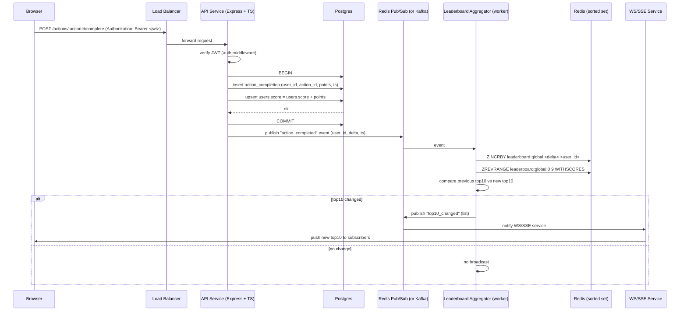

# Architecture

## Requirements

- Records user action to increase user's score.
- Show top 10 users with highest scores.
- Pushes live update when the leaderboard changes.
- Prevent malicious score manipulation.
- Support reasonable concurrency and scale

## Edge cases & asumptions
- Points per action are configured server-side.
- We assume no maximum score limit.
- Actions are idempotent because we store a request ID or nonce to detect and prevent duplicate processing.
- We assume clients use HTTPS and transport-level security.

## Tech Stack
- Node.js, TypeScript
- Express
- PostgreSQL
- Redis (for leaderboard cache)
- Kafka
- Docker for deployment

## Execution Flow


## Component diagram

```mermaid
graph TB
  Browser[Browser / Client]
  LB[Load Balancer / API Gateway]
  APIPods[API Service Pods<br/>Node.js + Express + TypeScript]
  Postgres[(PostgreSQL)]
  Redis[(Redis)<br/>- Pub/Sub<br/>- Sorted Set (ZSET) for leaderboard)]
  Aggregator[Aggregator Worker(s)]
  WSPods[WS/SSE Service Pods]
  Metrics[Monitoring / Tracing]

  Browser --> LB
  LB --> APIPods
  APIPods --> Postgres
  APIPods --> Redis
  APIPods -->|publish events| Redis
  Redis --> Aggregator
  Aggregator --> Redis
  Aggregator -->|notify| Redis
  Redis --> WSPods
  WSPods --> Browser
  APIPods --> Metrics
  Aggregator --> Metrics
  WSPods --> Metrics
```

## API specification

### Authentication

* Use JWT (signed with strong HMAC or RSA keys). JWT contains `sub=user_id`, `exp`, `iat`, roles/claims.
* All endpoints that mutate data must require `Authorization: Bearer <token>`.

## Additional improvement suggestions