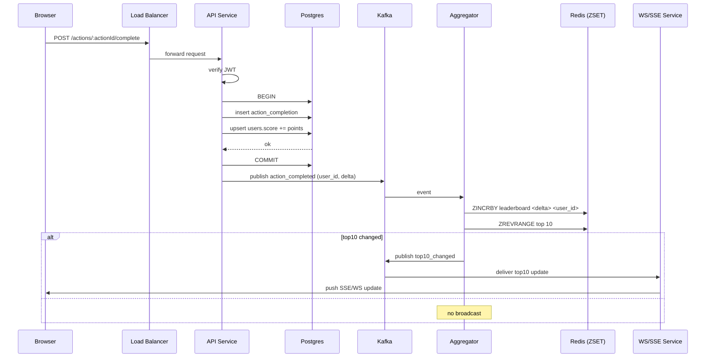
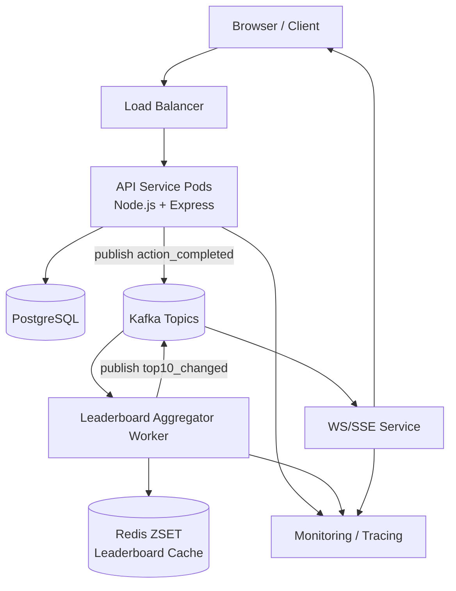

# Architecture

## Requirements

- Records user action to increase user's score.
- Show top 10 users with highest scores.
- Pushes live update when the leaderboard changes.
- Prevent malicious score manipulation.
- Support reasonable concurrency and scale

## Edge cases & asumptions
- Points per action are configured server-side.
- We assume no maximum score limit.
- Actions are idempotent because we store a request ID or nonce to detect and prevent duplicate processing.
- We assume clients use HTTPS and transport-level security.

## Tech Stack
- Node.js, TypeScript
- Express
- PostgreSQL
- Redis (for leaderboard cache)
- Kafka
- Docker for deployment

## Execution Flow

## Component diagram

## API specification

### Authentication

* Use JWT (signed with strong HMAC or RSA keys). JWT contains `sub=user_id`, `exp`, `iat`, roles/claims.
* All endpoints that mutate data must require `Authorization: Bearer <token>`.

## Database Schema
### users
| column     | type       | notes              |
| ---------- | ---------- | ------------------ |
| user_id    | UUID | PK                 |
| username   | text       | Optional           |
| score      | integer    | Updated atomically |
| created_at | timestamp  |                    |

### action_completions
| column     | type      | notes                |
| ---------- | --------- | -------------------- |
| id         | UUID      | PK                   |
| user_id    | FK(users) |                      |
| action_id  | text      | action type          |
| request_id | UUID      | for idempotency      |
| points     | integer   | computed server-side |
| created_at | timestamp |                      |

## Security & Anti score manipulation

### Idempotency

- Store a request_id for every action,
- Reject duplications.

### Replay prevention

- JWT must include iat with short expiry.
- Reject tokens older than configured threshold.

### Rate limit

#### Redis token bucket can help:

- Limit action completion per minute for each user.
- Helps detect score inflation.

## Additional suggestions

- Add action_types table to configure actions and points dynamically.
- Add fraud detection module to catch anomalies.
- Add integration tests simulating high concurrency and leaderboard churn.